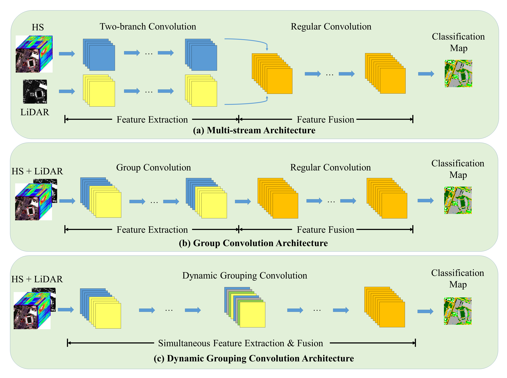

# CNNs for Multi-Source Remote Sensing Data Fusion

## Description

Pytorch implementation of the paper "Single-stream CNN with Learnable Architecture for Multi-source Remote Sensing Data". 

Multi-stream CNNs are commonly used in multi-source remote sensing data fusion. In this work we propose an efficient strategy that enables single-stream CNNs to approximate multi-stream models using group convolution. The proposed method is applied to ResNet and UNet, and evaluated on Houston2018, Berlin, MUUFL data sets, obtaining promising results. An interesting finding is that _regularization_ is playing an important role in these models. 

Find our paper at: [[IEEE Xplore]](https://ieeexplore.ieee.org/document/9761218)  [[arxiv]](http://arxiv.org/abs/2109.06094)

<div align="center">

</div>

## Usage
- Requirements: python3, pytorch, gdal, sklearn. 
- Simply run 
```
python3 main.py
```
- To customize training/model arguments, modify ```common.py```. Arguments are automatically loaded to ```main.py```.

## Baseline models

This repository also contains Pytorch implementation of the following models, which we use as baselines: 

- _Fusion-FCN_: A three-branch CNN for MS-HSI-LiDAR data fusion. Award-winning model in 2018 IEEE DFC. 
[[Paper]](https://ieeexplore.ieee.org/abstract/document/8518295/): "Multi-Source Remote Sensing Data Classification via Fully Convolutional Networks and Post-Classification Processing"

- _Two-branch CNN_ (_TB-CNN_): A two-branch CNN architecture for feasture fusion with HSI and other remote scensing imagery. [[Paper]](https://ieeexplore.ieee.org/abstract/document/8068943): "Multisource Remote Sensing Data Classification Based on Convolutional Neural Network" [[Official Tensorflow implementation]](https://github.com/Hsuxu/Two-branch-CNN-Multisource-RS-classification)

Implementation of these models can be found at ```model/baseline/```. 

## Data
We made some modifications (merely tif→numpy, stacking) to the original data files. Our data files are available at [this Google Drive site](https://drive.google.com/drive/folders/1urY6Pjba3mStDcRphIfkNf50295aW2o2?usp=sharing), which can be directly used in this code. Please note that we used channel-wise normalization AFTER loading these files, and this step is already implemented in our code. 

Below are links to the original data sets:

[[Houston2018]](https://ieee-dataport.org/open-access/2018-ieee-grss-data-fusion-challenge-%E2%80%93-fusion-multispectral-lidar-and-hyperspectral-data) &nbsp;
[[Berlin]](https://github.com/danfenghong/ISPRS_S2FL) &nbsp;
[[MUUFL]](https://github.com/GatorSense/MUUFLGulfport/tree/master/MUUFLGulfportSceneLabels) &nbsp;

## Results

| Dataset | OA (%) | Kappa |
| --- | ----------- | ----- |
| Houston2018 | 63.74 | 0.62 |
| Berlin | 68.21 | 0.54 |
| MUUFL | 86.44 | 0.83 |

## Citation

If you find our work helpful, please kindly cite: 
```
@ARTICLE{9761218,
  author={Yang, Yi and Zhu, Daoye and Qu, Tengteng and Wang, Qiangyu and Ren, Fuhu and Cheng, Chengqi},
  journal={IEEE Transactions on Geoscience and Remote Sensing}, 
  title={Single-Stream CNN With Learnable Architecture for Multisource Remote Sensing Data}, 
  year={2022},
  volume={60},
  number={},
  pages={1-18},
  doi={10.1109/TGRS.2022.3169163}}
```
